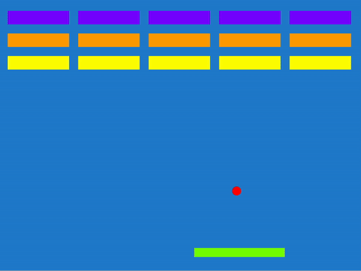

# Sample Breakout Game with Excalibur.js & Deno 2

This project follows the [Excalibur.js Getting Started Guide](https://excaliburjs.com/docs/getting-started/) using Deno 2. It's an experimental implementation for learning purposes.

## Prerequisites - Install Deno
`Deno: Version 2.0.0-rc.10 or later`

Install Deno following [their official guide](https://docs.deno.com/runtime/getting_started/installation/).

As of time of writing, Deno 2.0 is unreleased. To upgrade, follow: https://deno.com/blog/v2.0-release-candidate

## Running the Game

1. Clone this repository.

2. Build the game:
   ```bash
   deno task build
   ```

3. Open the game in your browser:
    - Double-click on `./game/index.html` in your file explorer
    - Or use the command line:
      ```bash
      open ./game/index.html
      ```

That's it! You should now see the Breakout game running in your browser.



## Development

If you want to modify the game:

1. Ensure you have Deno 2.0.0-rc.10 or later installed.

2. Run the development server with watch mode:
   ```bash
   deno task dev
   ```
   This will automatically rebuild when you make changes to the game files.

Note: The project uses Luca's esbuild Deno loader for bundling.
